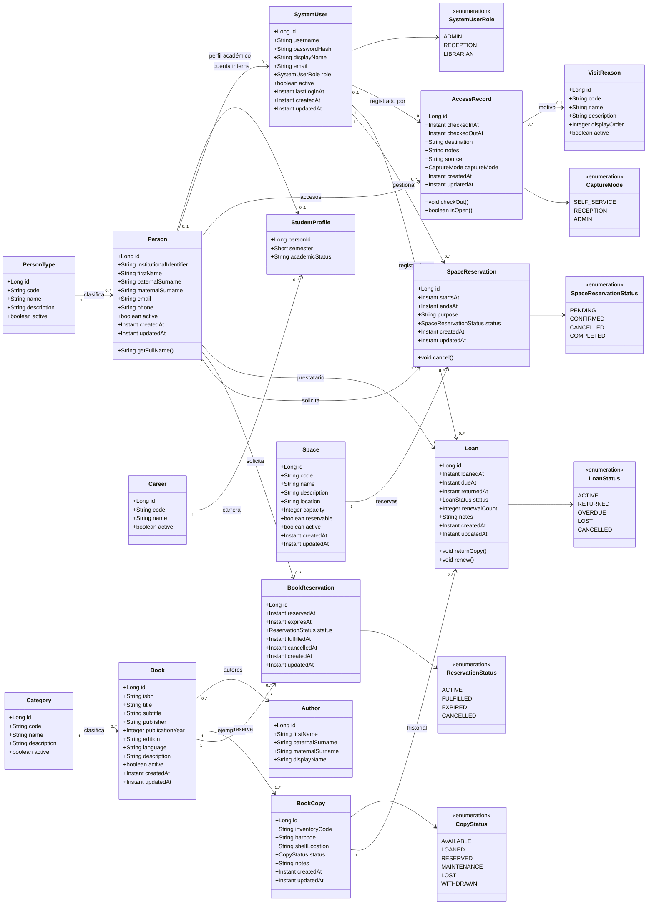

# BiblioTECa — Diagrama de clases final v1.0

> Alcance: modelo de dominio completo para la aplicación BiblioTECa, incluyendo
> personas, control de acceso, catálogo, circulación, espacios y usuarios internos.

## Decisiones de diseño

- `Person` es la entidad central para cualquier persona: estudiante, docente, personal o visitante.
- `PersonType` clasifica a `Person`; no existen clases separadas `Student`, `Teacher`, `Staff` o `Visitor`.
- `StudentProfile` contiene únicamente los datos académicos exclusivos del estudiante.
- `SystemUser` representa una cuenta interna del sistema, separada de `Person`.
- `AccessRecord` representa entrada y salida en un solo objeto.
- `Book` representa la obra bibliográfica y `BookCopy` el ejemplar físico.
- `Loan` representa el préstamo de un ejemplar a una persona.
- `BookReservation` representa una reserva/espera sobre una obra bibliográfica.
- `Space` representa un espacio físico reservable.
- `SpaceReservation` representa una reserva de espacio.
- Los roles y estados cerrados se modelan como enumeraciones.

## Diagrama UML

## Módulos del dominio

### Personas e identidad
- PersonType
- Person
- StudentProfile
- Career
- SystemUser
- SystemUserRole

### Control de acceso
- VisitReason
- AccessRecord
- CaptureMode

### Catálogo bibliográfico
- Category
- Author
- Book
- BookCopy
- CopyStatus

### Circulación
- Loan
- LoanStatus
- BookReservation
- ReservationStatus

### Espacios
- Space
- SpaceReservation
- SpaceReservationStatus

## Reglas principales

1. Una persona tiene un único tipo principal.
2. Sólo las personas de tipo estudiante deben poseer `StudentProfile`.
3. No toda persona tiene `SystemUser`; las cuentas internas son independientes del registro de acceso.
4. Una persona no debe tener más de un `AccessRecord` abierto al mismo tiempo.
5. Un ejemplar físico (`BookCopy`) sólo puede tener un préstamo activo al mismo tiempo.
6. Un préstamo activo debe referenciar un ejemplar existente y una persona activa.
7. Un ejemplar prestado no puede marcarse como disponible hasta cerrar el préstamo.
8. Una reserva bibliográfica se realiza sobre `Book`, no sobre un ejemplar concreto; al cumplirse puede asignarse un `BookCopy` disponible.
9. Una reserva de espacio no puede solaparse con otra reserva confirmada del mismo espacio.
10. Los usuarios internos gestionan operaciones administrativas, pero no sustituyen a `Person`.
11. Las eliminaciones históricas de préstamos, accesos y reservas deben evitar borrado físico cuando afecten trazabilidad.

## Nota sobre persistencia

En base de datos, la relación muchos-a-muchos entre `Book` y `Author` requiere una tabla de unión, por ejemplo `book_authors`. Esa tabla de unión no necesita ser una clase de dominio independiente salvo que en el futuro se agreguen atributos propios a la relación.

Este documento representa el modelo de clases que debe tomarse como referencia para cerrar el diseño antes de crear las migraciones restantes.
