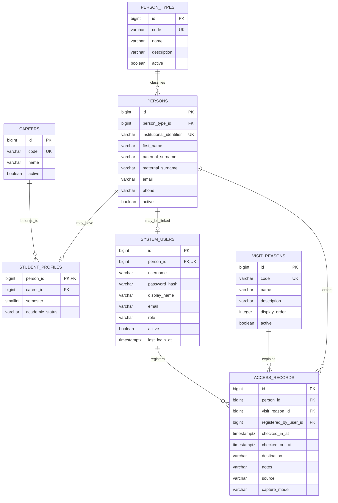

# Modelo final propuesto — BiblioTECa / Control de acceso v3

Este modelo cierra el dominio **de control de acceso**.

## Entidades persistentes

1. `PersonType`
2. `Person`
3. `Career`
4. `StudentProfile`
5. `VisitReason`
6. `AccessRecord`
7. `SystemUser`

`STUDENT`, `TEACHER`, `STAFF` y `VISITOR` son categorías de `Person`; no son
tablas separadas.

`ADMIN`, `RECEPTION` y `LIBRARIAN` son roles de `SystemUser`; no son
personas que ingresan por el hecho de tener una cuenta.

## Decisión de simplificación

No se crean `Student`, `Teacher`, `Staff` y `Visitor` como cuatro tablas
independientes. Todos son `Person`.

`StudentProfile` existe únicamente porque el estudiante sí tiene datos
académicos exclusivos: carrera, semestre y estado académico.

Tampoco se crea una tabla `Entry` y otra `Exit`: `AccessRecord` contiene ambas
marcas de tiempo.

## Importante sobre alcance

Este modelo deja completo el **control de acceso**.

Si `Catálogo`, `Circulación` o `Espacios` van a convertirse en módulos reales
de biblioteca (libros, ejemplares, préstamos, reservas), requieren su propio
modelo de dominio y NO deben improvisarse dentro de estas tablas.
